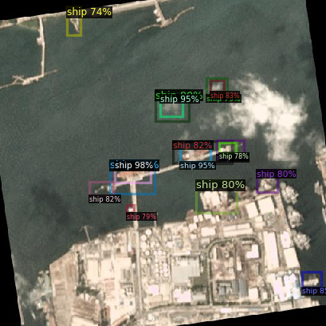

# Object detection in sattelite images with Yolo and Faster Rcnn

Satellite images can be used to detect ships, which has a huge potential in various critical applications:
Environmental Protection: To prevent environmental degradation, it is necessary to quickly identify ships in restricted marine zones.
Search and Rescue Operations: Helping rescue missions by finding lost or distressed ships in vast ocean expanses.
Port Management: Optimizing logistics and enhancing security measures requires efficient tracking of ships within shipping ports.
Maritime safety: The detection of ships can help prevent accidents at sea, which is one of the applications.
Fisheries management
marine pollution: Ship detection can be used for monitoring marine pollution, defense and maritime security, protection from piracy, and illegal immigration.
The objective of this project is to use satellite imagery for precise ship detection, which will contribute to enhanced environmental sustainability, safety at sea, and operational efficiency in maritime activities.

# Implimentation
For implementing object detection we used YOLO and also faster FASTER RCNN. 
In FASTER RCNN part we used two approach:. 
* Torch library
* Detectron library

## Yolo 
Process to train the mode:
1.	Fine-tune YOLOv8m
2.	Fine-tune YOLOv8n
3.	Prediction on both models
4.	Show result and compare them

## FASTER RCNN 
Process to train the mode:

### Torch
1.	convert data set to coco format
2.	train the model with resnet50
3.	evaluation model and test
### Detectron
1.	convert data to coco format
2.	load the data and train the model
3.	test and evaluate the model

## Detection Example

Yolo

Faster RCNN with Torch

Faster RCNN with Detectron

